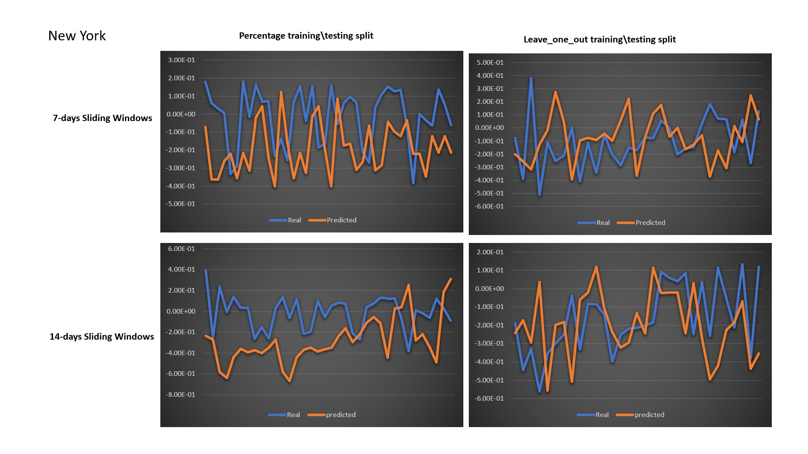

This project is about exploring the Symptom Survey data. For more details, please check [The COVID-19 Symptom Data Challenge
](https://www.symptomchallenge.org/challenge). This work is presented by RMITCruisers!

### Research Questions

1. How much the Symptom Surveys Dataset is effective and useful for the task of predicting the COVID-19 outbreaks?
2. What are the most important attributes included in the COVID-19 Symptom Surveys dataset? And does it correlate with the COVID-19 cases numbers?
3. What is the best period length that needed to be analyzed in order to be able to predict the next COVID-19 hot spots?
4. Is our proposed model able to predict the status of COVID-19 in the next period for a specific region?

### Data

1. [CMU US Symptom Survey](https://cmu.app.box.com/s/ymnmu3i125go4aue0qxosi3rbcae20bj)
2. [Wikipedia Case Number](https://en.wikipedia.org/wiki/Template:COVID-19_pandemic_data/United_States_medical_cases)

### Methods

#### Feature Selection

Survey symptom data consist of 49 signals. To study the effectiveness of each signal on our regression task (predicting the COVID-19 number of cases in the next period), we applied several feature importances and selection methods.

Top 10 important signals using Correlation-based Feature Subset Selection (CfsSubsetEval) with Best-First searching method:

-  pct_cli_anosmia_ageusia
- pct_hh_cli
- pct_cmnty_cli
- pct_hh_fever
- pct_hh_sore_throat
- pct_self_sore_throat
- pct_self_anosmia_ageusia  	
- pct_tested_no_result
-  pct_contact_covid_positive
-  pct_chronic_lung_disease

Top 5 important signals using Correlation_Attribute_Evaluation with Ranker searching method:

- pct_cmnty_cli 
- pct_tested_no_result 
- pct_self_anosmia_ageusia 
- pct_cli_anosmia_ageusia
- pct_hh_cli 

#### Framework

#### Sliding Window

### Results

#### Signal Correlation Level

| Signal                                                | **Correlation Coefficient with:** |                                |                                 | **Correlation Level** |
| ----------------------------------------------------- | --------------------------------- | ------------------------------ | ------------------------------- | --------------------- |
|                                                       | Number   of cases at Day (t)      | Number   of cases at Day (t+7) | Number   of cases at Day (t+14) |                       |
| `**pct_cli**`                                         | 0.845794                          | 0.839775                       | 0.778659                        | High                  |
| `**pct_ili**`                                         | 0.835365                          | 0.843734                       | 0.770253                        | High                  |
| `**pct_cli_anosmia_ageusia**`                         | 0.894225                          | 0.874242                       | 0.835944                        | High                  |
| `**pct_hh_cli**`                                      | 0.850482                          | 0.866007                       | 0.849477                        | High                  |
| `**pct_cmnty_cli**`                                   | 0.90177                           | 0.858973                       | 0.81876                         | High                  |
| `**pct_hh_fever**`                                    | 0.83951                           | 0.853687                       | 0.85638                         | High                  |
| `**pct_hh_sore_throat**`                              | 0.883051                          | 0.877679                       | 0.775481                        | High                  |
| `**pct_hh_cough**`                                    | 0.915259                          | 0.881138                       | 0.849374                        | High                  |
| `**pct_hh_shortness_of_breath**`                      | 0.870266                          | 0.823401                       | 0.819656                        | High                  |
| `**pct_hh_difficulty_breathing**`                     | 0.785473                          | 0.764737                       | 0.826895                        | Medium                |
| `**mean_hh_cli_ct**`                                  | -0.07766                          | -0.07864                       | -0.07895                        | Low                   |
| `**mean_cmnty_cli_ct**`                               | 0.078007                          | 0.042624                       | 0.067344                        | Low                   |
| `**pct_self_fever**`                                  | 0.852142                          | 0.850236                       | 0.85978                         | High                  |
| `**pct_self_cough**`                                  | 0.918108                          | 0.887696                       | 0.854417                        | High                  |
| `**pct_self_shortness_of_breath**`                    | 0.840073                          | 0.794574                       | 0.775854                        | Medium                |
| `**pct_self_difficulty_breathing**`                   | 0.746246                          | 0.69635                        | 0.70717                         | Medium                |
| `**pct_self_tiredness_or_exhaustion**`                | 0.710986                          | 0.652613                       | 0.548318                        | Medium                |
| `**pct_self_nasal_congestion**`                       | 0.800225                          | 0.737115                       | 0.64246                         | Medium                |
| `**pct_self_runny_nose**`                             | 0.819162                          | 0.776758                       | 0.713303                        | Medium                |
| `**pct_self_muscle_joint_aches**`                     | 0.658033                          | 0.613735                       | 0.570806                        | Medium                |
| `**pct_self_sore_throat**`                            | 0.877361                          | 0.855911                       | 0.747666                        | High                  |
| `**pct_self_persistent_pain_pressure_in_chest**`      | 0.861816                          | 0.842485                       | 0.774653                        | High                  |
| `**pct_self_nausea_vomiting**`                        | 0.742849                          | 0.7084                         | 0.698316                        | Medium                |
| `**pct_self_diarrhea**`                               | 0.731119                          | 0.693315                       | 0.665093                        | Medium                |
| `**pct_self_anosmia_ageusia**`                        | 0.882297                          | 0.857097                       | 0.818654                        | High                  |
| `**pct_self_other**`                                  | 0.728041                          | 0.663625                       | 0.649116                        | Medium                |
| `**pct_self_none_of_above**`                          | -0.84388                          | -0.79618                       | -0.72666                        | Medium                |
| `**pct_self_multiple_symptoms**`                      | 0.841124                          | 0.792329                       | 0.729804                        | Medium                |
| `**pct_tested_and_positive**`                         | 0.077262                          | 0.073716                       | -0.00828                        | Low                   |
| `**pct_tested_and_negative**`                         | -0.75293                          | -0.72132                       | -0.68504                        | Medium                |
| `**pct_tested_no_result**`                            | -0.5723                           | -0.51073                       | -0.54853                        | Medium                |
| `**pct_could_not_get_tested**`                        | 0.872317                          | 0.847069                       | 0.849789                        | High                  |
| `**pct_did_not_try_to_get_tested**`                   | 0.637301                          | 0.594901                       | 0.557595                        | Medium                |
| `**pct_worked_outside_home**`                         | -0.7984                           | -0.77978                       | -0.81                           | Medium                |
| `**pct_avoid_contact_all_or_most_time**`              | 0.832288                          | 0.79818                        | 0.767904                        | Medium                |
| `**mean_outside_hh_contact_at_work_ct**`              | -0.02752                          | -0.04589                       | -0.04883                        | Low                   |
| `**mean_outside_hh_contact_shopping_ct**`             | -0.02752                          | -0.04589                       | -0.04883                        | Low                   |
| `**mean_outside_hh_contact_in_social_gatherings_ct**` | -0.02752                          | -0.04589                       | -0.04883                        | Low                   |
| `**pct_contact_covid_positive**`                      | 0.406657                          | 0.312647                       | 0.279885                        | Low                   |
| `**pct_diabetes**`                                    | -0.02583                          | -0.00792                       | 0.135396                        | Low                   |
| `**pct_cancer**`                                      | -0.34784                          | -0.31023                       | -0.19781                        | Low                   |
| `**pct_heart_disease**`                               | 0.018515                          | 0.024036                       | 0.273324                        | Low                   |
| `**pct_high_blood_pressure**`                         | -0.11938                          | -0.12891                       | 0.066745                        | Low                   |
| `**pct_asthma**`                                      | 0.331519                          | 0.237131                       | 0.183508                        | Low                   |
| `**pct_chronic_lung_disease**`                        | 0.327577                          | 0.309082                       | 0.362006                        | Low                   |
| `**pct_kidney_disease**`                              | -0.10964                          | -0.08656                       | 0.004669                        | Low                   |
| `**pct_autoimmune_disorder**`                         | 0.03901                           | -0.0048                        | -0.10529                        | Low                   |
| `**pct_no_above_medical_conditions**`                 | -0.02898                          | 0.036896                       | -0.11839                        | Low                   |
| `**pct_multiple_medical_conditions**`                 | 0.013971                          | 0.010143                       | 0.21526                         | Low                   |

#### Results of Four States

|{width=50%}|
|:--:|
| *The RMSE results of using the LSTM model with different configurations and states.* |

#### Without Less Important Signals

||
|:--:|
| *The RMSE results after removing the less important signals.* |

#### Prediction VS Real

### Conclusion

- Symptom Surveys dataset would be very useful for future prediction of COVID-19 cases.
- Not all signals are useful for predictions. Important signals are more helpful for the prediction.
- Our model is able to predict the trend (decreasing/increasing) of the case number of a state with selected important signals.

### Future Work
- Combining other open datasets to further improve the prediction performance.
- Integrate our prediction model into COVID Forecast Hub for better visualization.
- How to make recommendations for the government regarding policy decisions based on the prediction results.

#### Team Members
- Futoon Abu Shaqra 
- Flora Salim
- Yongli Ren
- Hao Xue

#### Contacts

Hao Xue (hao.xue@rmit.edu.au)

